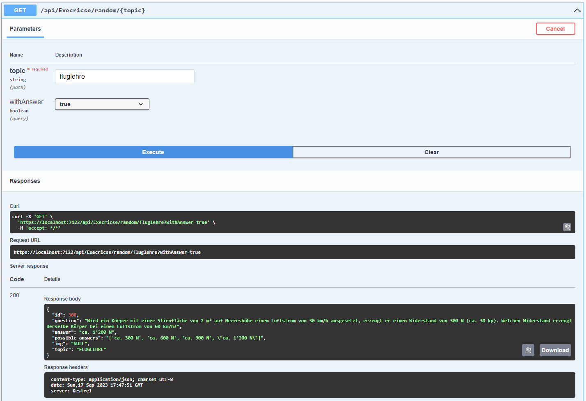

<br/>
<p align="center">
  <h3 align="center">paraglidus-api</h3>

  <p align="center">
    The ulimate API to Paragliding Exam Prep (German)!
    <br/>
    <br/>
    <a href="https://github.com/eliasthecactus/paraglidus-api">View Demo</a>
    <a href="https://github.com/eliasthecactus/paraglidus-api/issues">Report Bug</a>
    <a href="https://github.com/eliasthecactus/paraglidus-api/issues">Request Feature</a>
  </p>
</p>

   

## About The Project



Prepare with confidence for your paragliding theory exam in Switzerland with this comprehensive API. All the questions included are sourced from SHV/FSVL, ensuring that you're well-prepared for the official examination. Whether you're a beginner or an experienced paraglider, this API provides a valuable resource to test your knowledge and enhance your understanding of key paragliding concepts, regulations, and safety guidelines in Switzerland. Elevate your chances of success in the exam with this dedicated study tool.

## Built With

I scraped the data with selenium, stored it into SQLite and built the API with ASP.NET

* [ASP.NET](https://dotnet.microsoft.com/en-us/apps/aspnet)
* [SQLite](https://www.sqlite.org/index.html)
* [Selenium](https://www.selenium.dev/)

## Getting Started

To test the API just open the Project in Visual Studio and run it

### Prerequisites

Install dotNet

https://dotnet.microsoft.com/en-us/download

### Installation

1. Clone the repo
```sh
git clone https://github.com/eliasthecactus/paraglidus-api.git
```
2. Open the project in Visual Studio
3. Run it

## Usage

Just use Swagger

## Roadmap

See the [open issues](https://github.com/eliasthecactus/paraglidus-api/issues) for a list of proposed features (and known issues).

## Contributing

Contributions are what make the open source community such an amazing place to be learn, inspire, and create. Any contributions you make are **greatly appreciated**.
* If you have suggestions for adding or removing projects, feel free to [open an issue](https://github.com/eliasthecactus/paraglidus-api/issues/new) to discuss it, or directly create a pull request after you edit the *README.md* file with necessary changes.
* Please make sure you check your spelling and grammar.
* Create individual PR for each suggestion.

### Creating A Pull Request

1. Fork the Project
2. Create your Feature Branch (`git checkout -b feature/AmazingFeature`)
3. Commit your Changes (`git commit -m 'Add some AmazingFeature'`)
4. Push to the Branch (`git push origin feature/AmazingFeature`)
5. Open a Pull Request

## License

Distributed under the MIT License. See [LICENSE](https://github.com/eliasthecactus/paraglidus-api/blob/main/LICENSE) for more information.

## Authors

* **Elias** - [Telegram](https://t.me/s2223am)
